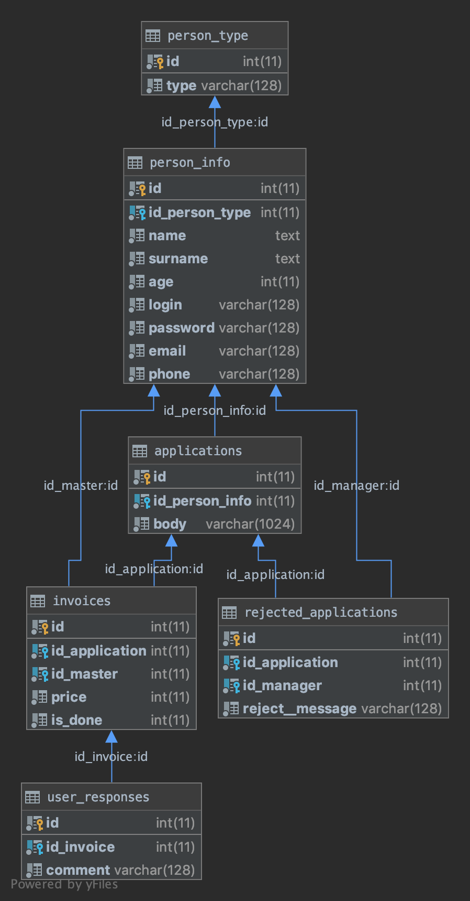
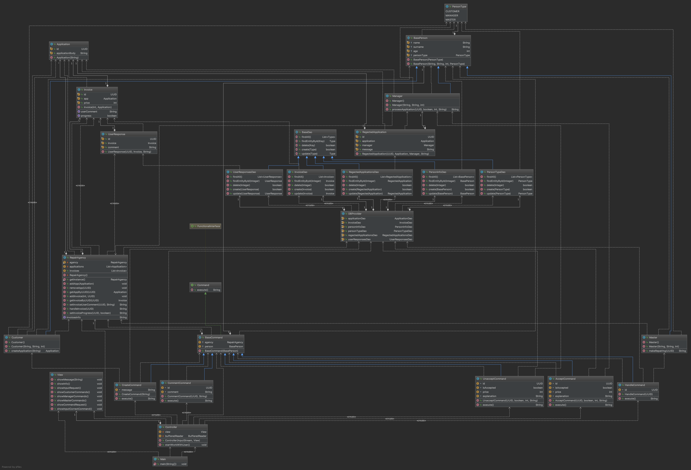

# JavaLabRepairAgency

## Опис завдання

*Варіант 17: Система "Ремонтна агенція"*

Система ремонтної агенції передбачає наступні ролі: користувач, менеджер, майстер. Користувач може створити заявку на ремонт виробу. Менеджер має прийняти заявку, вказавши ціну ремонту користувачеві, або відхилити заявку, вказавши причину. Майстер виконує прийняту заявку. Користувач може залишити відгук про виконані роботи. Система також надає можливість переглядати історію, виконаних майстром заявок.

## Схема бази даних

	

*Пояснення до таблиць:*
- person_type - дані про типи персон
- person_info - дані про користувачів, менеджерів та мастерів
- applications - дані про заявки
- invoices - дані про накладні
- rejected_applications - дані про відхилені заявки
- user_responses - дані про відгуки користувачів

## Діаграма класів

	

Застосунок реалізовано відповідно до архітектурного шаблону MVC.

*Класи моделі:*

В основі всієї нашої системи полягає будь-яка персона. Тобто користувач, менеджер та майстер. Вони мають багато спільних даних та відрізняються кожен своїм власним функціоналом. Тому було створено абстрактний клас BasePerson та його нащадки відповідно: Customer, Manager та Master. Також у флоу моделі були задіяні наступні класи: Application, Invoice, RegectedApplication, UserResponse. Тобто відповідні класи до бд(заявки, відмовлені заявки, накладні та відгуки користувачів). Основну роль у керуванні заявками та накладними відіграє клас RepairAgency. Також було створено BaseDao клас, який є базовим для його нащадків таких, як ApplicationDao, InvoiceDao, InvoiceDao, PersonTypeDao, PersonTypeDao, PersonTypeDao. Також для доступу до цих обьєктів було створено DBProvider, котрий дає доступ до відповідних dao-objects.

*Класи контролера:*

Для основного керування моделлю та взаємодією з користувачем було створено клас Controller. В залежності від введених користувачем команд на наступних кроках розгортається наступна логіка, для якої було створено інтерфейс Command та базовий клас BaseCommand, що утримують в собі логіку та взаємодіють з базою даних через відповідні dao-objects. Було створено наступні dao-objects: CommentCommand, CreateCommand для Customer, AcceptCommand, UnacceptCommand для Manager та HandleCommand для Master відповідно. Команди виконують дії відповідні до їх назви.

*Класи представлення:*

Було створено клас View, який виводить логи у консоль та віддає відповідний http-представлення з необхідними даними у форматі JSP-сторінок.
